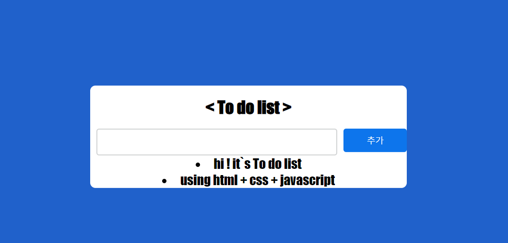
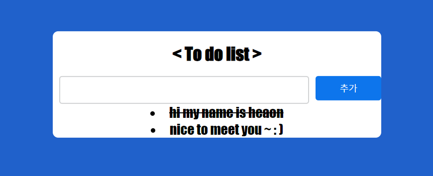
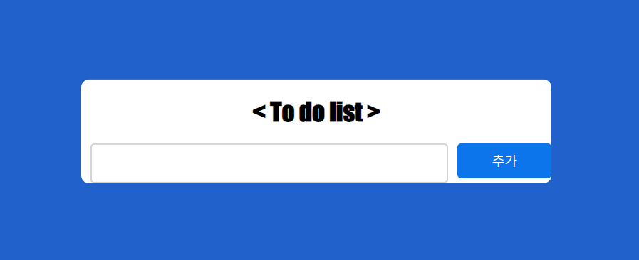

## 프로젝트 ToDoList 소개 

 

### 🖐️ 안녕하세요 해당 repository 에 대해 소개드릴 JHeaon 입니다. 

 

해당 리포지토리는 처음으로 배운 Javascript, html, css 을 통해서 ToDoList 를 만들어 보는 프로젝트 입니다. 

  

### 🎆 해당 프로젝트에서 사용한 기술과 개발 그리고 과정

 

🟧  사용한 기술 :  Javascript, html, css  

Html, css, Javascript 을 이용하여 ToDoList을 만들었습니다. 

색은 시원한 파란색으로 정했고, 텍스트 내용을 채운뒤 추가 버튼을 누르면 해당 내용이 추가되도록 구성하였습니다. 

추가된 내용을 한번 클릭하게 되면 밑줄 두번 클릭하면 아예 삭제되도록 개발하였습니다. 
 

 

  

  
 
  

 

Sence 같은 경우에는 GameStart, GamePlay, GameOver 3가지로 나누어 처리하였으며, 각 이벤트들을 C# 스크립트를 개발하여 처리 할 수 있도록 개발 하였습니다. 

  

### ✏️ 해당 프로젝트를 하면서 느낀 점과 배운점

 

javascript을 통해서 이벤트 구현하는 것이 생각보다 어려웠습니다.이번 ToDoList를 구현하는데 있어서의 어려움은 크게 없었지만, 좀 더 복잡한 기능을 구현하는데 있어서 알아야 하는 부분이 많아서 해당 부분을 공부하는 계기가 되었습니다. 

Css을 통해서 UI 디자인하는 부분이 아직 저에게는 많이 힘들다고 느꼈습니다. 

  

### ✌️ Readme.md 에 게시된 내용은 아래 블로그에서도 확인하실수 있습니다. 

 

▪️ To do list 프로젝트 : https://blog.naver.com/j3heawon/222788420898